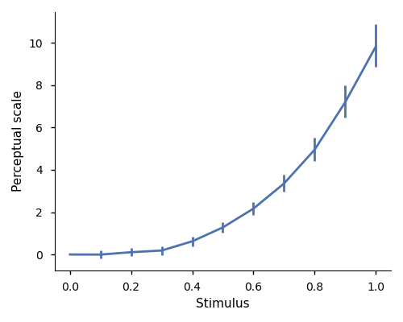

# Python wrapper for Maximum likelihood difference scaling (MLDS) R package

[](https://github.com/computational-psychology/mlds/actions/workflows/ci-tests.yml)
[](https://zenodo.org/doi/10.5281/zenodo.12658147)

This python package contains:

- a python implementation that wraps the R package MLDS. This wrapper makes easier to analyse the data obtained in MLDS experiments, without having to leave python. It also provides the extra functionality to using parallel processing, making the bootstrap calculation of confidence intervals much faster.

- function to predict discrimination thresholds from a scale, as published in [Aguilar, Wichmann & Maertens (2017)](https://jov.arvojournals.org/article.aspx?articleid=2433839).

- functions to simulate an observer performing an MLDS experiment (so far only for the method of triads).

- utilities for designing MLDS experiments (method of triads and quadruples)


## Requirements

- Python >= 3.8 with numpy, subprocess, multiprocessing, and rpy2

- R, with the *MLDS*, *psyphy* and *snow* packages

Python module dependencies are installed automatically.

R packages must be installed manually, either from CRAN (see below)
or using the files provided in this repository (mlds/CRAN).


## Installation

- Install R

- Install the required R packages. You can do it from inside R with

```R
install.packages(c("MLDS", "psyphy", "snow"))
```

or from the command line with

```bash
R -e 'install.packages(c("MLDS", "psyphy", "snow"))'
```

- Install the mlds wrapper (this package). In the console run

```bash
pip install https://github.com/computational-psychology/mlds/tarball/master
```

The python dependencies will be installed automatically.


## Quick start

Experimental data should be saved in a CSV file, an example file is provided here: [*data_triads.csv*](examples/data_triads.csv).
The file needs to have at least the following columns (naming of the columns is important!):
- *s1*, *s2* and *s3*, containing the stimulus values for each of the stimulus presented in the triad
- *Response*: coding the binary response of the observer (which pair was perceived more different? 1 for pair (*s2*, *s3*), 0 otherwise

The code

```python
import mlds

obs = mlds.MLDSObject('data_triads.csv',
                      standardscale=False, # standard scale normalizes range from 0 to 1
                      boot=True) # to calculate confidence intervals via bootstrap
```

creates an object `obs` that will talk to R, pass the data, do the fit and
return the results to python. Until now the object is just initialized;
to run the actual analysis we do

```python
obs.run()  # the wrapper now sends the commands to R, and R runs the fitting.
```

Now we can get the stimulus values and estimated scales with

```python
print(obs.stim)
print(obs.scale)
```

and plot the perceptual scale with

```python
import matplotlib.pyplot as plt

fig, ax = plt.subplots(1, 1, figsize=(5, 4))
ax.errorbar(obs.stim, obs.scale, yerr=abs(obs.ci95 - obs.mns), color='#4C72B0',
             linewidth=2, elinewidth=2)
ax.set_xlabel('Stimulus')
ax.set_ylabel('Perceptual scale')
ax.spines[['right', 'top']].set_visible(False)
plt.tight_layout()
plt.show()
```




A more detailed usage example can be found in [here](examples/example.py).


## Usage examples

- [examples/example.py](examples/example.py) show how to analyse data for a triads experiment.
- [examples/example_quadruples.py](examples/example_quadruples.py) show how to analyse data for a quadruples experiment.
- [examples/example_stim_generation.py](examples/example_stim_generation.py) gives usage example for designing the triads or quadruples given the stimulus intensities.
- [examples/example_simulation.py](examples/example_simulation.py) shows how to simulate an observer performing the method of triads.
- [examples/example_predict_thresholds.py](examples/example_predict_thresholds.py) shows how to predict discrimination thresholds from a perceptual scale, using signal detection theory assumptions. See [Aguilar, Wichmann & Maertens (2017)](https://jov.arvojournals.org/article.aspx?articleid=2433839) for details.


Contact
=======
Questions? Feedback? Don't hesitate to ask Guillermo Aguilar (guillermo.aguilar@mail.tu-berlin.de)

This implementation has a testing suite that gets run on every release. Testing is done in python >=3.8 and Ubuntu.

